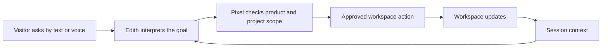

# Pixel

**Developed by [PushkarSikharam](https://github.com/PushkarSikharam)**

Pixel is a scoped project workspace guided by Edith, a conversational demo agent. The product shows how a visitor can ask naturally, by text or voice, and watch the workspace respond through controlled actions.


[Full product architecture](docs/SYSTEM_ARCHITECTURE.md)

[Phase 1 audit and migration baseline](docs/PHASE_1_BASELINE.md): verified behavior,
known release blockers, test results, and ownership for the customer-isolation roadmap.

Open **System architecture** in the workspace navigation, or visit `/architecture`, for the visual product walkthrough, control model and current boundaries.



The current product is a controlled adaptive demo. It supports scoped project workspaces, guided creation flows, contextual follow-ups, interruption handling, Microsoft Azure Speech synthesis when configured, and product guardrails. It is not a production multi-tenant SaaS system yet; real identity, permission checks and live integrations still need to be added before real customer data is used.

Current phase:

```text
Phase 1 complete: single-product demo baseline, stabilized and locked.
Authentication, workspace authorization, record integrity, owned sessions and
reliable saves are in place and covered by tests.
Next: Phase 2, real sign-in and per-customer isolation. Demo identities are not
real accounts, so this is not yet ready for private customer data.
```

Run the frontend:

```bash
npm install
npm run dev:web
```

On Windows PowerShell, use `npm.cmd` if script execution blocks `npm.ps1`:

```bash
npm.cmd install
npm.cmd run dev:web
```

Backend setup:

```bash
py -m venv .venv
.venv\Scripts\python -m pip install -r apps\api\requirements.txt
.venv\Scripts\python -m uvicorn app.main:app --app-dir apps\api --reload --port 8001
```

The local demo needs `PIXEL_SYNTHETIC_DEMO=true` and `PIXEL_DEMO_SEEDS=true` in the API environment (see `.env.example`). Without `PIXEL_DEMO_SEEDS=true`, no demo organization, team, users or product are created, so a private visitor session cannot start.

The browser defaults to the app's local API bridge. Each browser session receives a private demo instance from the same approved seed, so one visitor's tickets, projects, cycles, members and resets cannot affect another visitor. **Restart** clears only the conversation; **Reset** confirms and restores only the current visitor's data.

Azure voice setup:

```text
AZURE_SPEECH_KEY=your_rotated_azure_speech_key
AZURE_SPEECH_REGION=eastus
AZURE_SPEECH_VOICE_NAME=en-US-JennyNeural
```

Put those values in the repository-root `.env.local` (the API reads only the root `.env.local` and `.env`, never `apps/web/.env.local`). The Speech key must stay server-side and must not be committed. If a key was pasted into chat or shared anywhere, rotate it in Azure before using it.

Root scripts:

```bash
npm.cmd run dev:api
npm.cmd run dev:web
npm.cmd run start:api
npm.cmd run lint:web
npm.cmd run test:api
npm.cmd run test:web
npm.cmd run test:e2e
npm.cmd run build:web
```

Demo path:

```text
1. show sprint planning
2. open ticket for maya
3. create a ticket for Maya about login bug
4. how do I assign Maya's ticket
5. set up github integration
6. open salesforce
```

The same path is available as suggested turns in the chat panel. Use Reset to start a clean reviewer session.

[SYSTEM_ARCHITECTURE.md](docs/SYSTEM_ARCHITECTURE.md) describes the current product behavior and remaining boundaries. The original architecture plan and implementation blueprint that preceded it are no longer in the tree; they remain in git history.
